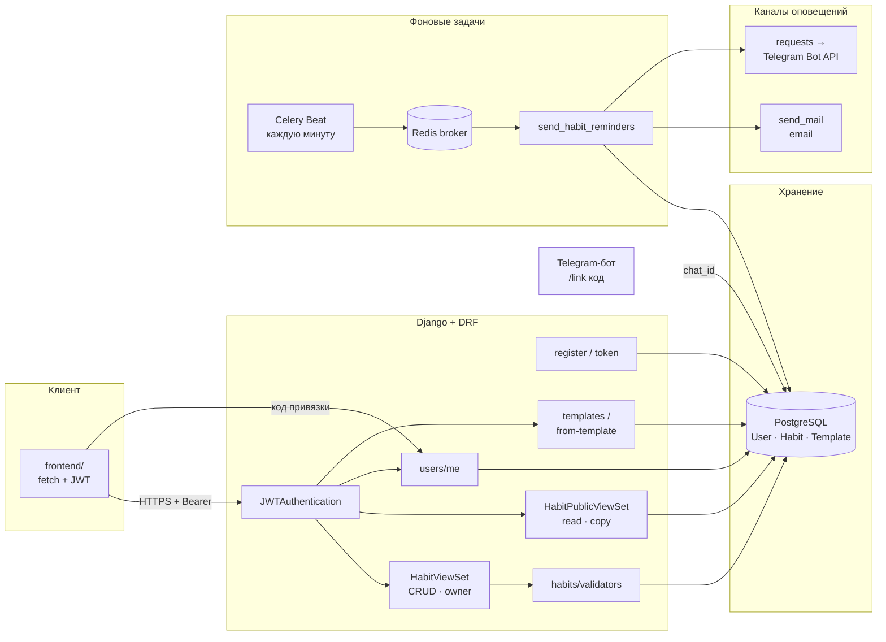
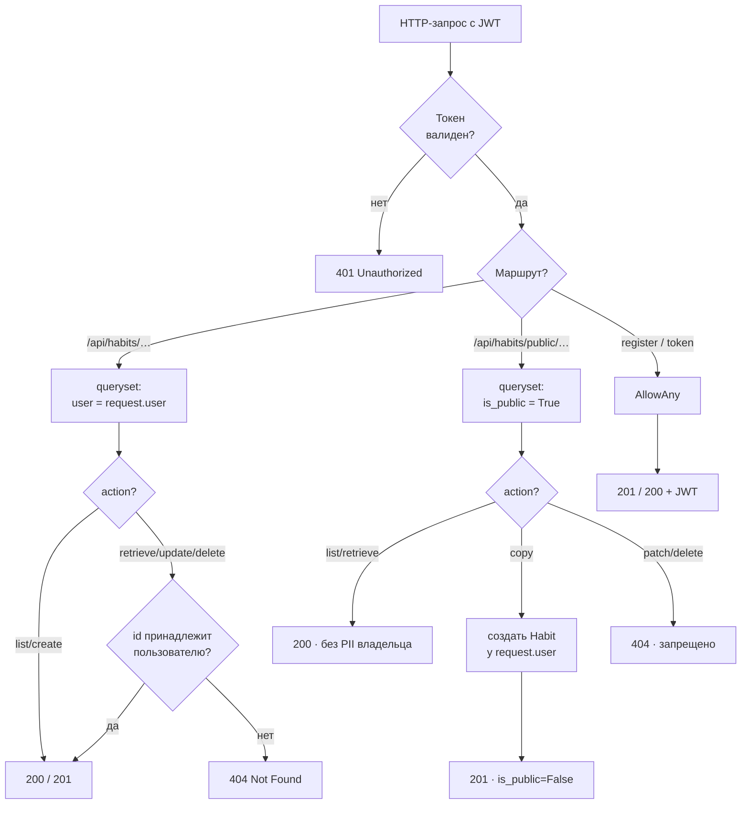
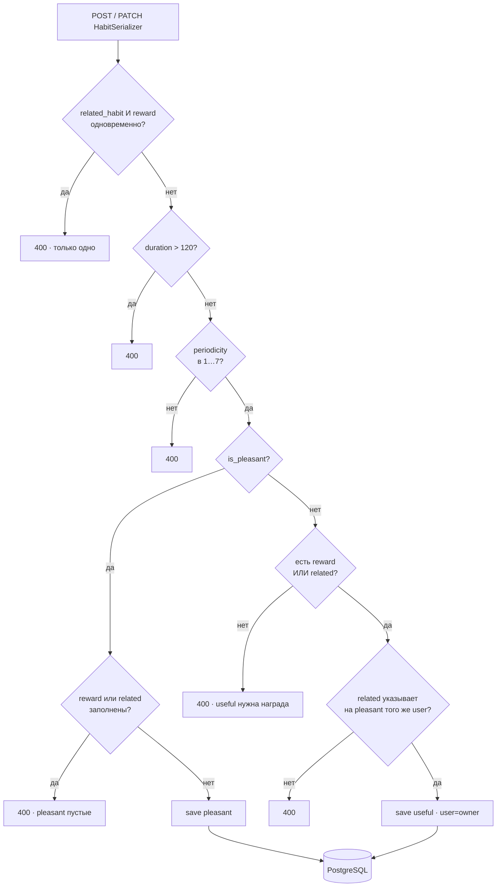
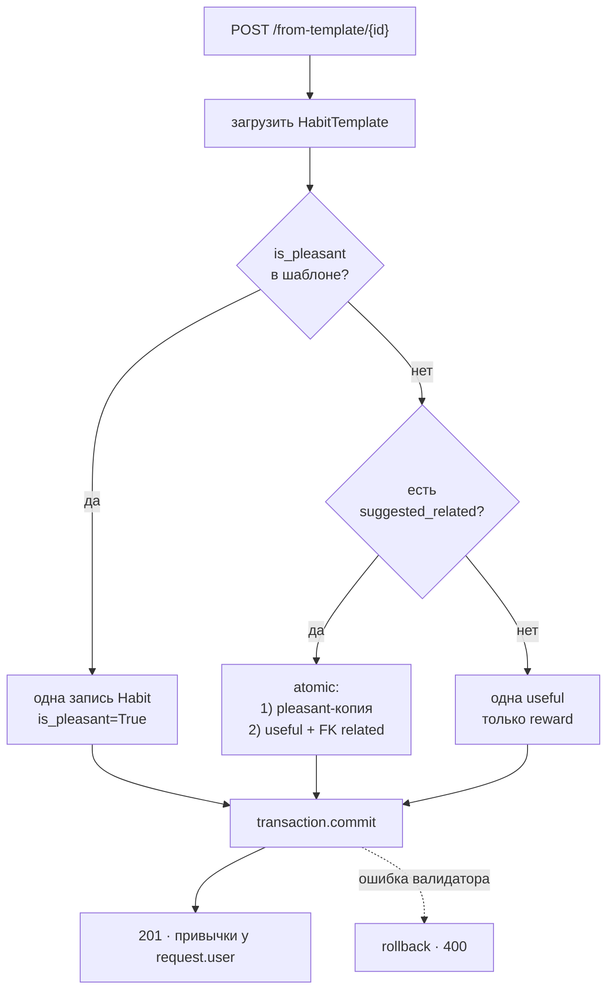
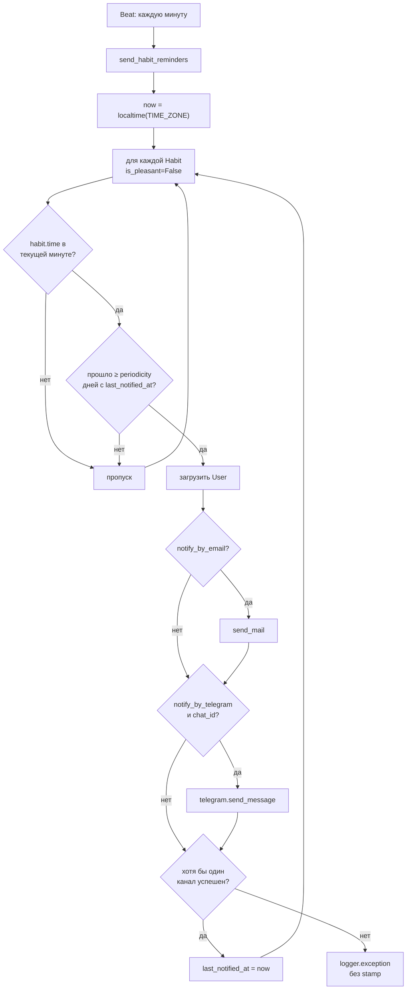
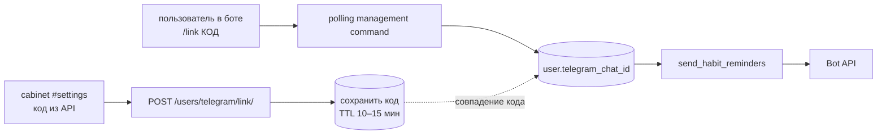

# Atomic Habit Tracker

Backend и API для трекера привычек по принципам *Atomic Habits*: полезные и приятные
привычки, связки, публичная лента, напоминания в Telegram и по email.

**Стек:** Django 6, DRF, SimpleJWT, PostgreSQL, Celery + Redis, drf-yasg, Bootstrap 5.3 (фронт).

Репозиторий: [github.com/webmiko/Atomic-Habit-Tracker](https://github.com/webmiko/Atomic-Habit-Tracker)

---

## Логика приложения (блок-схемы)

Ниже — **алгоритмы и взаимодействия** системы, а не порядок разработки.
Прямоугольник — процесс · ромб — условие · цилиндр — хранилище · параллелограмм — ввод/вывод.

### 1. Компоненты и потоки данных



### 2. Доступ к привычке (API)



### 3. Алгоритм: сохранение привычки (валидация)



### 4. Алгоритм: привычка из шаблона (`from-template`)



### 5. Алгоритм: напоминания (Celery Beat)



Ошибка одного канала **не блокирует** второй; stamp только после успешной отправки.

### 6. Привязка Telegram



---

## Прогресс реализации

| Этап | Статус | Ветка |
|------|--------|-------|
| Окружение, Postgres, зависимости | ✅ | `main` / `develop` |
| Каркас Django | ✅ | `feature/step_1` |
| JWT и профиль пользователя | ✅ | `feature/step_1` |
| API привычек, напоминания, фронт | ⬜ | `feature/step_N` |

`main` ← `develop` ← `feature/step_N` (PR после каждого этапа).

---

## Требования

- Python **3.14+**
- [Poetry](https://python-poetry.org/) 2.x
- **PostgreSQL** 14+
- **Redis** (с шага 7 — Celery)

---

## Быстрый старт

```bash
git clone https://github.com/webmiko/Atomic-Habit-Tracker.git
cd Atomic-Habit-Tracker
git checkout feature/step_1   # или актуальная feature-ветка

poetry install
cp .env.template .env         # заполните DB_* и позже TELEGRAM_BOT_TOKEN
```

### PostgreSQL

Пример (подставьте свои имя БД и пользователя):

```sql
CREATE DATABASE atomic_habits;
```

В `.env`: `DB_NAME`, `DB_USER`, `DB_PASSWORD`, `DB_HOST`, `DB_PORT`.

После шага 1:

```bash
poetry run python manage.py migrate
poetry run python manage.py runserver
```

### Переменные окружения

Шаблон для копирования — **`.env.template`** (в репозитории). Локальный **`.env`**
не коммитится; создайте его из шаблона.

| Группа | Назначение |
|--------|------------|
| `SECRET_KEY`, `DEBUG`, `ALLOWED_HOSTS` | Django |
| `DB_*` | PostgreSQL |
| `CELERY_*` | Redis |
| `TELEGRAM_BOT_TOKEN` | бот |
| `EMAIL_*` | по умолчанию console backend для отладки |

---

## Качество кода

```bash
poetry run ruff check .
poetry run ruff format .
poetry run mypy .
poetry run pytest
poetry run pytest --cov=config --cov=users --cov=habits --cov-report=term-missing
```

Лимит строки в коде: **119** символов (Ruff).

| Команда | Назначение |
|---------|------------|
| `make install` | `poetry install` |
| `make lint` / `format` / `typecheck` / `test` | см. `Makefile` |
| `make check` | lint + format + mypy + test |

### Фронтенд

```bash
poetry run python manage.py runserver
# из каталога frontend/ — Live Server :5500 или:
cd frontend && python -m http.server 5500
```

Демо-аккаунты: `poetry run python manage.py seed_demo_users`  
(`demo_a@example.com` / `demo_b@example.com`, пароль `DemoPass123!`).

При раздаче через Gunicorn/WhiteNoise (см. ниже) фронт и API на одном порту —
`frontend/js/config.js` берёт `window.location.origin` (кроме Live Server `:5500`).

### Деплой (Docker Compose)

Стек: PostgreSQL, Redis, Gunicorn + WhiteNoise (фронт из `frontend/`), Celery worker и beat.

```bash
cp .env.template .env   # SECRET_KEY обязателен; для compose подойдут DB_* из примера ниже
docker compose up --build
# или: make docker-up
```

- API и UI: http://127.0.0.1:8000/login.html (корень `/` → `login.html`)
- Swagger: http://127.0.0.1:8000/swagger/

В `docker-compose.yml` для сервиса `web` заданы `DB_HOST=db`, Redis и `DEBUG=False`.
Локальный `.env` с `DB_HOST=localhost` не мешает — переменные compose перекрывают хост БД.

После первого запуска (опционально, в контейнере web):

```bash
docker compose exec web poetry run python manage.py seed_demo_users
```

Остановка: `docker compose down` или `make docker-down`.

---

## Структура репозитория

```text
├── config/              # settings, urls, wsgi
├── users/               # User (email), admin
├── habits/              # приложение привычек (модели — ит.3)
├── tests/               # pytest + pytest-django
├── frontend/            # Bootstrap 5.3 + vanilla JS (Live Server :5500)
├── Dockerfile
├── docker-compose.yml
├── scripts/docker-entrypoint.sh
├── manage.py
├── pyproject.toml
├── poetry.lock
├── .env.template
├── wiki/
└── README.md
```

---

## API

| Метод | URL | Описание |
|-------|-----|----------|
| POST | `/api/users/register/` | регистрация |
| POST | `/api/token/`, `/api/token/refresh/` | JWT |
| GET/PATCH | `/api/users/me/` | профиль и настройки |
| GET/POST | `/api/habits/` | мои привычки |
| GET/PATCH/DELETE | `/api/habits/{id}/` | одна привычка |
| GET | `/api/habits/public/` | публичная лента |
| POST | `/api/habits/public/{id}/copy/` | копия к себе |
| GET | `/api/habits/templates/` | каталог шаблонов |

Документация: `/swagger/`, `/redoc/`.

---

## Зависимости (Poetry)

| Пакет | Назначение |
|-------|------------|
| django, djangorestframework | API |
| djangorestframework-simplejwt | JWT |
| django-cors-headers, drf-yasg | CORS, OpenAPI |
| celery, redis, django-celery-beat | периодические задачи |
| psycopg2-binary | PostgreSQL |
| requests | Telegram Bot API |
| gunicorn, whitenoise | прод-сервер и статика фронта |
| python-dotenv | переменные из `.env` |

Dev: pytest, pytest-django, pytest-cov, ruff, mypy.

---

## Критерии сдачи курса (кратко)

| # | Тема |
|---|------|
| 1 | CORS |
| 2 | Telegram / email по расписанию |
| 3 | Пагинация (`count`, `next`, `previous`, `results`, ≤5) |
| 4 | `.env` + `.env.template` |
| 5–7 | Модели, API, валидаторы |
| 8 | JWT |
| 9 | Celery без ошибок в runtime |
| 10 | Покрытие тестами ≥80% |
| 11 | PEP 8 (Ruff) |
| 12–13 | Зависимости в `pyproject.toml`, Swagger |

Подробная документация: **[wiki/Home.md](wiki/Home.md)** (установка, API, Celery, чеклист сдачи).
