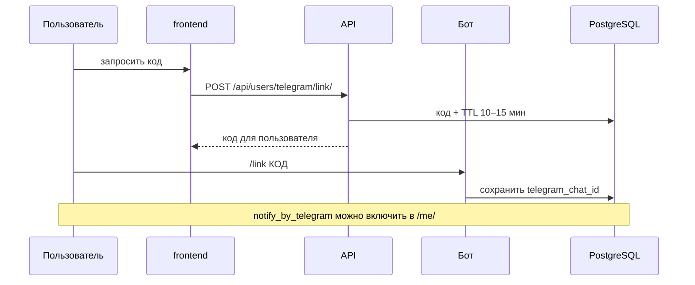

# Telegram-бот

## Настройка

1. Создайте бота у [@BotFather](https://t.me/BotFather).
2. Скопируйте токен в `.env`:

```env
TELEGRAM_BOT_TOKEN=123456:ABC...
```

3. Не коммитьте `.env` и не выводите токен в логах API.

## Привязка аккаунта



| Шаг | Действие |
|-----|----------|
| 1 | В кабинете «Настройки» получить код (API) |
| 2 | В боте отправить `/link <код>` |
| 3 | Включить `notify_by_telegram` в профиле |

Команда `/start` — краткая инструкция.

## Сервис `users/services/telegram.py`

```python
def send_message(chat_id: str, text: str) -> None:
    ...
```

- Токен только из `os.getenv("TELEGRAM_BOT_TOKEN")`.
- При ошибке Bot API — лог на сервере, клиенту API — общий ответ без текста Telegram.

## Параметры кода привязки

| Параметр | Значение |
|----------|----------|
| Длина кода | 8 символов |
| TTL | 15 минут (`users/services/link_codes.py`) |
| Использование | одноразовый; старые коды пользователя удаляются при новом запросе |

Пустой `telegram_chat_id` в профиле сохраняется как `NULL` (unique constraint).

## Запуск polling

Отдельный процесс (не внутри gunicorn):

```bash
poetry run python manage.py run_telegram_bot
```

## Безопасность

- `telegram_chat_id` не отдаётся в REST API (только флаг `telegram_linked` в `/me/`).
- Не включать токен в Swagger-схему.
- В логах не печатать traceback с URL `.../bot<TOKEN>/...` (`users/services/telegram.py`).
